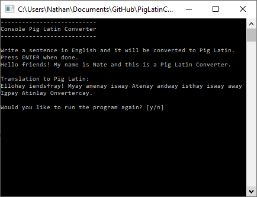

# Pig Latin Converter

### Convert English sentences into Pig Latin!

The Pig Latin Converter was written in C# using Visual Studio 2017.
Made by Nathan Ladd.

### The Rules:
> Move first consonant cluster of the word to the end of the
> word and add "ay". If the word starts with a  vowel, then
> we add "way" at the end of the word instead.
